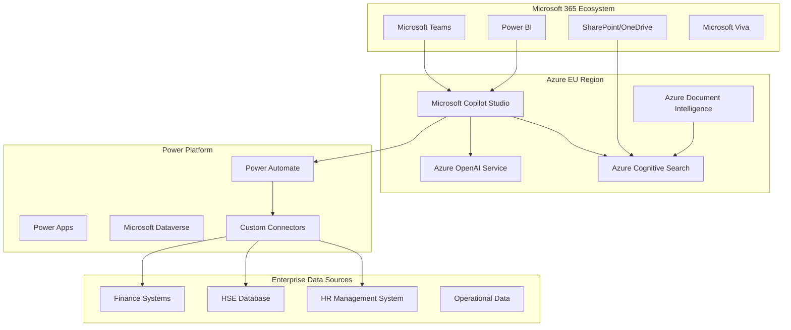
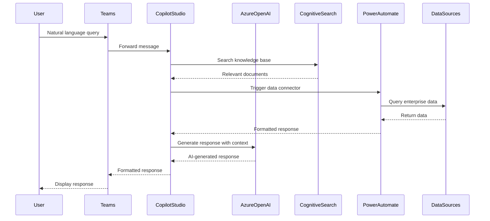

# Design Document

## Overview

The Swire Intelligence Assistant will be built as a new Microsoft Copilot Studio-based solution leveraging Azure OpenAI Service, Azure Cognitive Search, and Power Platform integrations. This architecture ensures EU data residency compliance while providing enterprise-grade security and seamless integration with Microsoft 365 ecosystem.

This new application will run independently from the existing SageGreen system, which will continue to serve as Swire's Renewable Energy and ESG Intelligence application. The new solution uses Microsoft Copilot Studio with Power Platform connectors for comprehensive enterprise data integration.

## Architecture

### High-Level Architecture



### Data Flow Architecture



## Components and Interfaces

### 1. Microsoft Copilot Studio Configuration

**Purpose**: Central orchestration platform for conversation management and AI responses

**Key Features**:

- Visual conversation flow designer
- Topic-based conversation routing
- Integration with Azure OpenAI Service
- Built-in analytics and monitoring
- Multi-channel deployment (Teams, Power BI, Web)

**Configuration Elements**:

- **Topics**: Pre-defined conversation patterns for finance, HSE, HR queries
- **Entities**: Structured data extraction (dates, locations, metrics)
- **Variables**: Session state management and context preservation
- **Actions**: Integration points with Power Platform and external systems

### 2. Azure OpenAI Service Integration

**Purpose**: EU-compliant large language model processing

**Configuration**:

- **Model**: GPT-4 or GPT-3.5-turbo deployed in West Europe region
- **Content Filtering**: Enterprise-grade content safety filters
- **Rate Limiting**: Configured for enterprise usage patterns
- **Prompt Engineering**: Swire-specific system prompts and context

**Security Features**:

- Virtual Network integration for private connectivity
- Managed Identity authentication
- Customer-managed encryption keys
- Audit logging for all API calls

### 3. Azure Cognitive Search (Knowledge Base)

**Purpose**: Intelligent document search and retrieval for RAG implementation

**Index Structure**:

```json
{
  "name": "swire-knowledge-base",
  "fields": [
    { "name": "id", "type": "Edm.String", "key": true },
    { "name": "content", "type": "Edm.String", "searchable": true },
    { "name": "title", "type": "Edm.String", "searchable": true },
    { "name": "source", "type": "Edm.String", "filterable": true },
    { "name": "department", "type": "Edm.String", "filterable": true },
    { "name": "lastModified", "type": "Edm.DateTimeOffset", "sortable": true },
    {
      "name": "contentVector",
      "type": "Collection(Edm.Single)",
      "searchable": true
    }
  ]
}
```

**Data Sources**:

- SharePoint document libraries
- OneDrive business files
- Azure Blob Storage for legacy documents
- Real-time indexing through Power Automate workflows

### 4. Power Platform Connectors

**Finance Connector**:

- **Type**: Custom connector using OpenAPI specification
- **Authentication**: OAuth 2.0 with service principal
- **Operations**: GetRevenue, GetExpenses, GetBudgetVariance, GetKPIs
- **Data Format**: JSON with standardized financial metrics schema

**HSE Connector**:

- **Type**: SQL Server connector with custom stored procedures
- **Operations**: GetIncidentReports, GetSafetyMetrics, GetComplianceStatus
- **Document Processing**: Integration with Azure Document Intelligence for PDF analysis
- **Real-time Updates**: Power Automate flows for incident report processing

**HR Connector**:

- **Type**: Microsoft Graph API connector
- **Operations**: GetWorkforceMetrics, GetAttendanceData, GetPerformanceData
- **Privacy Controls**: Role-based data filtering and anonymization
- **Compliance**: GDPR-compliant data handling with retention policies

### 5. Teams Integration Layer

**Bot Framework Integration**:

- Native Microsoft Copilot Studio deployment to Teams
- Adaptive Cards for rich response formatting
- Proactive messaging for alerts and notifications
- Multi-turn conversation support with context preservation

**Channel Support**:

- Direct messages with the copilot
- Channel conversations with @mentions
- Meeting integration for real-time insights
- Mobile Teams app compatibility

### 6. Power BI Integration

**Embedded Chat Widget**:

- Custom visual component for Power BI reports
- Context-aware responses based on current report data
- Drill-down capabilities through conversational interface
- Export functionality for insights and recommendations

**Q&A Enhancement**:

- Natural language queries about specific visualizations
- Automated insight generation for anomalies and trends
- Cross-report analysis and recommendations
- Scheduled report summaries through Teams notifications

## Data Models

### Conversation Context Model

```typescript
interface ConversationContext {
  sessionId: string;
  userId: string;
  department: string;
  permissions: string[];
  currentTopic: string;
  entities: {
    dateRange?: DateRange;
    location?: string;
    metrics?: string[];
    department?: string;
  };
  conversationHistory: Message[];
  lastActivity: Date;
}
```

### Enterprise Data Schema

```typescript
interface FinanceData {
  period: string;
  revenue: number;
  expenses: number;
  budgetVariance: number;
  kpis: {
    name: string;
    value: number;
    target: number;
    trend: "up" | "down" | "stable";
  }[];
}

interface HSEIncident {
  incidentId: string;
  date: Date;
  location: string;
  severity: "low" | "medium" | "high" | "critical";
  category: string;
  description: string;
  status: "open" | "investigating" | "resolved";
  assignedTo: string;
}

interface WorkforceMetrics {
  period: string;
  totalEmployees: number;
  manHours: number;
  attendanceRate: number;
  productivityScore: number;
  departmentBreakdown: {
    department: string;
    headcount: number;
    utilization: number;
  }[];
}
```

### Knowledge Base Document Model

```typescript
interface KnowledgeDocument {
  id: string;
  title: string;
  content: string;
  source: "sharepoint" | "onedrive" | "upload";
  department: string;
  documentType: "policy" | "procedure" | "report" | "manual";
  tags: string[];
  lastModified: Date;
  accessLevel: "public" | "restricted" | "confidential";
  embedding: number[];
}
```

## Error Handling

### Azure OpenAI Service Errors

**Rate Limiting**:

- Implement exponential backoff with jitter
- Queue management for high-volume periods
- Graceful degradation to cached responses
- User notification of temporary delays

**Content Filtering**:

- Custom error messages for filtered content
- Alternative response suggestions
- Escalation to human support when appropriate
- Audit logging for compliance review

**Service Unavailability**:

- Fallback to pre-configured responses
- Integration with Azure Service Health API
- Automatic retry mechanisms with circuit breaker pattern
- Status page integration for transparency

### Data Connector Failures

**Database Connectivity**:

- Connection pooling and retry logic
- Cached data fallback for critical metrics
- Health check endpoints for monitoring
- Automatic failover to secondary data sources

**Authentication Failures**:

- Token refresh automation
- Service principal rotation handling
- Multi-factor authentication bypass for service accounts
- Detailed error logging for security analysis

**Data Quality Issues**:

- Input validation and sanitization
- Schema validation for API responses
- Data freshness checks and warnings
- Graceful handling of incomplete datasets

## Testing Strategy

### Unit Testing

**Copilot Studio Topics**:

- Conversation flow validation using Bot Framework Emulator
- Entity extraction accuracy testing
- Response template validation
- Integration point mocking for isolated testing

**Power Platform Connectors**:

- API endpoint testing with mock data
- Authentication flow validation
- Error handling scenario testing
- Performance benchmarking under load

### Integration Testing

**End-to-End Scenarios**:

- Complete user journey testing from Teams to data sources
- Cross-domain query validation (finance + HSE + HR)
- Multi-turn conversation context preservation
- Role-based access control verification

**Security Testing**:

- Penetration testing for API endpoints
- Data leakage prevention validation
- Authentication and authorization testing
- Compliance audit simulation

### Performance Testing

**Load Testing**:

- Concurrent user simulation (up to 500 simultaneous users)
- Azure OpenAI Service rate limit testing
- Database connector performance under load
- Teams integration scalability testing

**Response Time Optimization**:

- Cognitive Search query optimization
- Caching strategy validation
- Network latency measurement and optimization
- Mobile device performance testing

### User Acceptance Testing

**Business User Scenarios**:

- Finance manager monthly reporting workflow
- HSE incident analysis and trend identification
- HR workforce planning and analytics
- Cross-departmental collaboration scenarios

**Accessibility Testing**:

- Screen reader compatibility in Teams
- Voice input/output functionality
- Mobile accessibility compliance
- Multi-language support validation

### Compliance Testing

**EU Data Residency Verification**:

- Data processing location audit
- Cross-border data transfer monitoring
- Encryption in transit and at rest validation
- Retention policy compliance testing

**Security Compliance**:

- SOC 2 Type II compliance validation
- ISO 27001 security controls testing
- GDPR data protection impact assessment
- Industry-specific compliance requirements (if applicable)

## Deployment Strategy

### Phased Rollout

**Phase 1: Core Infrastructure (Weeks 1-2)**

- Azure OpenAI Service deployment in West Europe
- Azure Cognitive Search setup and initial indexing
- Basic Copilot Studio configuration with simple topics

**Phase 2: Data Integration (Weeks 3-4)**

- Power Platform connector development and testing
- SharePoint and OneDrive integration
- Initial knowledge base population

**Phase 3: Teams Integration (Weeks 5-6)**

- Teams app deployment to pilot group
- User training and feedback collection
- Performance optimization based on usage patterns

**Phase 4: Full Deployment (Weeks 7-8)**

- Organization-wide rollout
- Power BI integration activation
- Mobile access enablement
- Comprehensive monitoring and alerting setup

### Monitoring and Maintenance

**Operational Monitoring**:

- Azure Application Insights for performance metrics
- Power Platform admin center for connector health
- Teams usage analytics and adoption metrics
- Custom dashboards for business KPIs

**Security Monitoring**:

- Azure Sentinel for security event correlation
- Conditional access policy compliance monitoring
- Data loss prevention policy effectiveness
- Regular security assessment and penetration testing

**Continuous Improvement**:

- User feedback collection and analysis
- Conversation analytics for topic optimization
- A/B testing for response effectiveness
- Regular model updates and fine-tuning
